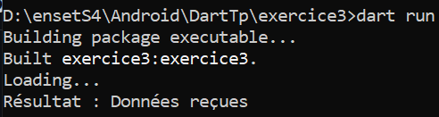

# Exercice 3 – Programmation Asynchrone en Dart

## Objectifs
- Apprendre à gérer l’asynchronisme avec `Future`, `async`, et `await`
- Comprendre les différences avec Java et JavaScript

---

## Description du fonctionnement

1. Une fonction `fetchData()` utilise `Future.delayed` pour simuler une attente de 2 secondes.
2. Dans `main()`, on affiche `Loading...`, puis on attend `fetchData()` avec `await`.
3. Une fois les données récupérées, on affiche `Données reçues`.

---

## Comparaisons avec Java et JavaScript

### ➤ En Java :

En Java, pour simuler une attente :

```java
try {
    System.out.println("Loading...");
    Thread.sleep(2000); // pause de 2 secondes
    System.out.println("Données reçues");
} catch (InterruptedException e) {
    e.printStackTrace();
}
```

* `Thread.sleep()` bloque le thread principal (non asynchrone)
* Gestion plus complexe si on veut un vrai comportement non bloquant (via `FutureTask`, `ExecutorService`, etc.)

---

### ➤ En JavaScript (ES6) :

```javascript
function fetchData() {
  return new Promise(resolve => {
    setTimeout(() => {
      resolve("Données reçues");
    }, 2000);
  });
}

async function main() {
  console.log("Loading...");
  const data = await fetchData();
  console.log(`Résultat : ${data}`);
}

main();
```

* Asynchrone natif via `Promise` et `async/await`
* Très similaire à Dart sur ce point

---

## Résultat Terminal (optionnel)

<p align="center">
  
</p>

---

**Conclusion** :

* Dart et JavaScript utilisent un modèle `async/await` très similaire
* Java est plus verbeux et moins intuitif pour les appels non bloquants

